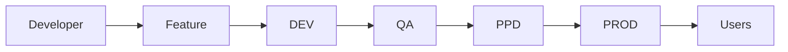
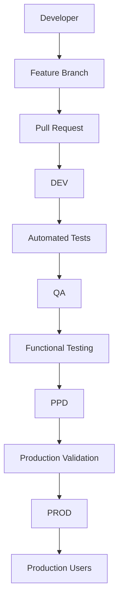
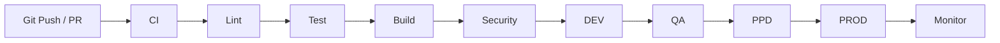
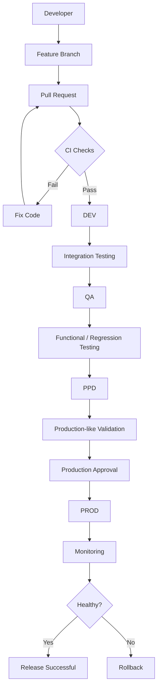

# 🚀 Production-Grade Git Branching Strategy

A practical implementation of a **production-grade Git branching and promotion strategy** designed to simulate how application code moves safely through multiple environments before reaching production.

This project demonstrates how development teams can use **Git branches, Pull Requests, environment promotion, feature isolation, bug-fix workflows, release validation, and controlled production deployments** to reduce deployment risk.

> **Demo:** Production Git Branching Strategy — Real-World Practical Demo
> **Video:** https://youtu.be/tOb-9HHqrIU

---

# 📌 Table of Contents

* [Project Overview](#-project-overview)
* [Why Git Branching Strategy Matters](#-why-git-branching-strategy-matters)
* [Architecture](#-architecture)
* [Branching Strategy](#-branching-strategy)
* [Branch Responsibilities](#-branch-responsibilities)
* [Complete Code Promotion Flow](#-complete-code-promotion-flow)
* [Environment Architecture](#-environment-architecture)
* [Feature Development Workflow](#-feature-development-workflow)
* [Development Environment](#-development-environment)
* [QA Environment](#-qa-environment)
* [Pre-Production Environment](#-pre-production-environment)
* [Production Environment](#-production-environment)
* [Bug Fix Workflow](#-bug-fix-workflow)
* [Pull Request Strategy](#-pull-request-strategy)
* [CI/CD Integration](#-cicd-integration)
* [Deployment Strategy](#-deployment-strategy)
* [Rollback Strategy](#-rollback-strategy)
* [Git Revert vs Reset](#-git-revert-vs-reset)
* [Handling Accidental Production Merges](#-handling-accidental-production-merges)
* [Git Commands](#-important-git-commands)
* [Git Concepts Demonstrated](#-git-concepts-demonstrated)
* [Production Safety Controls](#-production-safety-controls)
* [Branch Protection](#-branch-protection)
* [Common Problems](#-common-problems)
* [Troubleshooting](#-troubleshooting)
* [Best Practices](#-best-practices)
* [Real-World Interview Explanation](#-real-world-interview-explanation)
* [Production Scenario](#-production-scenario)
* [Lessons Learned](#-lessons-learned)
* [Future Improvements](#-future-improvements)

---

# 🎯 Project Overview

This project demonstrates a production-oriented Git branching model where application changes are progressively promoted through different environments.

Instead of allowing developers to directly modify or deploy production code, changes follow a controlled promotion path:

```text
Feature Branch
      |
      v
     DEV
      |
      v
      QA
      |
      v
     PPD
      |
      v
    PROD
```

Where:

* `feature/*` → Individual feature development
* `bugfix/*` → Bug fixes
* `dev` → Development integration
* `qa` → Quality Assurance testing
* `ppd` → Pre-Production validation
* `prod` → Production

---

# 🧠 Why Git Branching Strategy Matters

In a small project, a developer can make changes directly to the main branch.

In a production environment, this approach is dangerous.

Imagine:

```text
Developer
    |
    v
Production
```

A single incorrect commit could immediately impact customers.

A production-grade approach introduces controlled stages:

```text
Developer
    |
    v
Feature Branch
    |
    v
Development
    |
    v
QA
    |
    v
Pre-Production
    |
    v
Production
```

Each stage provides an opportunity to detect problems before they reach production.

---

# 🏗️ Architecture

## High-Level Architecture



The fundamental principle is:

> **Code should become progressively more trusted as it moves toward production.**

---

# 🌳 Branching Strategy

The project follows this branching model:

```text
                         feature/login
                              |
                              |
                         feature/search
                              |
                              v
                             DEV
                              |
                              v
                              QA
                              |
                              v
                             PPD
                              |
                              v
                            PROD
```

Additional branches can be created for:

```text
feature/*
bugfix/*
hotfix/*
release/*
```

depending on the team's requirements.

---

# 🌲 Branch Architecture

```mermaid
gitGraph

    commit id: "Initial"

    branch dev
    checkout dev

    branch feature/login
    checkout feature/login
    commit id: "Login feature"

    checkout dev
    merge feature/login

    branch qa
    checkout qa
    merge dev

    branch ppd
    checkout ppd
    merge qa

    checkout main
```

Conceptually, the important promotion path is:

```text
feature
   ↓
 dev
   ↓
 qa
   ↓
 ppd
   ↓
 prod
```

---

# 🔀 Branch Responsibilities

## 1. Feature Branch

Example:

```text
feature/login
feature/search
feature/payment
```

Purpose:

* Isolate new functionality
* Allow independent development
* Prevent incomplete code from entering shared branches

Example:

```bash
git switch -c feature/payment
```

---

# 2. Bugfix Branch

Example:

```text
bugfix/search-validation
```

Purpose:

* Fix application defects
* Keep bug fixes isolated
* Allow review before integration

Example:

```bash
git switch -c bugfix/search-validation
```

---

# 3. DEV Branch

The `dev` branch is the primary **development integration environment**.

Multiple completed features can be integrated here.

```text
feature/login
      |
feature/search
      |
feature/payment
      |
      v
     DEV
```

Typical activities:

* Integration testing
* Developer validation
* Automated CI tests
* Basic application testing

---

# 4. QA Branch

The `qa` branch represents the **Quality Assurance environment**.

Code promoted here should already have passed the development validation stage.

Typical activities:

* Functional testing
* Regression testing
* Integration testing
* API testing
* UI testing
* Negative testing

---

# 5. PPD Branch

`ppd` represents **Pre-Production**.

This environment should be as close to production as practical.

Typical activities:

* Final integration testing
* Deployment validation
* Configuration validation
* Smoke testing
* Performance validation
* Production-like testing

---

# 6. PROD Branch

`prod` represents production.

Only validated and approved code should reach this branch.

```text
PPD
 |
 | Pull Request
 | Review
 | Approval
 | CI/CD validation
 |
 v
PROD
```

---

# 🔄 Complete Code Promotion Flow

The complete workflow is:



---

# 🌍 Environment Architecture

Each Git branch represents a controlled deployment environment.

```text
┌───────────────────────┐
│   Feature Branches    │
│ feature/login         │
│ feature/payment       │
│ feature/search        │
└───────────┬───────────┘
            │
            ▼
┌───────────────────────┐
│         DEV           │
│ Development Testing   │
└───────────┬───────────┘
            │
            ▼
┌───────────────────────┐
│          QA           │
│ Functional Testing    │
└───────────┬───────────┘
            │
            ▼
┌───────────────────────┐
│         PPD           │
│ Production-like Test  │
└───────────┬───────────┘
            │
            ▼
┌───────────────────────┐
│         PROD          │
│ Production            │
└───────────────────────┘
```

---

# 💻 Feature Development Workflow

Suppose a developer needs to implement a payment feature.

Create a branch:

```bash
git switch dev
git pull origin dev

git switch -c feature/payment
```

Develop the feature:

```text
feature/payment
```

Make changes:

```bash
git add .
git commit -m "Add payment functionality"
```

Push:

```bash
git push origin feature/payment
```

Create a Pull Request:

```text
feature/payment
        ↓
       dev
```

---

# 🔎 Pull Request Review

A Pull Request provides a controlled checkpoint before code enters a shared branch.

Typical PR process:

```text
Developer
    |
    v
Feature Branch
    |
    v
Push Code
    |
    v
Pull Request
    |
    +---- Code Review
    |
    +---- CI Checks
    |
    +---- Automated Tests
    |
    +---- Security Scan
    |
    v
Merge
```

---

# 🧪 Development Environment

Once a feature is merged into `dev`, CI/CD can deploy the branch to the development environment.

```text
Developer
    |
    v
feature/payment
    |
    v
Pull Request
    |
    v
DEV
    |
    v
Automated Testing
```

The goal is to identify problems early.

---

# 🧪 QA Environment

After development validation:

```text
DEV
 |
 | Promotion
 v
QA
```

QA validates:

```text
Functional behavior
Regression
Integration
API
UI
Authentication
Authorization
Error handling
```

---

# 🏭 Pre-Production Environment

After QA approval:

```text
QA
 |
 v
PPD
```

PPD should closely resemble production.

For example:

```text
PPD
 |
 +--> Same application version
 |
 +--> Similar infrastructure
 |
 +--> Similar configuration
 |
 +--> Similar networking
 |
 +--> Similar database behavior
 |
 +--> Same deployment mechanism
```

This reduces the chance of:

> "It worked in QA but failed in production."

---

# 🚀 Production Environment

Only validated code reaches production.

```text
PPD
 |
 | PR
 | Review
 | Approval
 | CI/CD
 v
PROD
 |
 v
Users
```

Production deployment should ideally include:

* Automated validation
* Approval
* Monitoring
* Health checks
* Rollback capability

---

# 🐛 Bug Fix Workflow

Suppose a search validation bug is discovered.

Create:

```bash
git switch -c bugfix/search-validation
```

Make the fix:

```bash
git add .
git commit -m "Fix search validation bug"
```

Push:

```bash
git push origin bugfix/search-validation
```

Create:

```text
bugfix/search-validation
            |
            v
           DEV
            |
            v
            QA
            |
            v
           PPD
            |
            v
          PROD
```

---

# 🚑 Hotfix Workflow

Critical production incidents may require a faster path.

Example:

```text
PROD
 |
 | Critical issue
 v
hotfix/payment-timeout
 |
 v
Testing
 |
 v
PROD
```

A hotfix should still be:

* Reviewed
* Tested
* Audited
* Monitored

The exact hotfix workflow depends on the organization's release policy.

---

# 🔐 Pull Request Strategy

Production branches should not normally be directly writable by developers.

Recommended:

```text
feature → dev
dev → qa
qa → ppd
ppd → prod
```

Each transition happens through a Pull Request.

---

# 🤖 CI/CD Integration

A production-grade branching strategy becomes much more powerful when integrated with CI/CD.

Example:



---

# 🔧 CI Pipeline

Typical CI stages:

```text
Checkout
   |
   v
Install Dependencies
   |
   v
Lint
   |
   v
Unit Tests
   |
   v
Integration Tests
   |
   v
Security Scan
   |
   v
Build
   |
   v
Artifact / Docker Image
```

A failed stage should stop the pipeline.

For example:

```text
Lint ❌
 |
 X
No deployment
```

This prevents known-bad code from progressing.

---

# 🚢 CD Pipeline

A deployment pipeline can promote artifacts through environments:

```text
Build Once
    |
    v
Artifact
    |
    +----> DEV
    |
    +----> QA
    |
    +----> PPD
    |
    +----> PROD
```

An important production principle is:

> **Build once, promote the same artifact.**

Avoid rebuilding the application separately for every environment unless there is a specific reason.

---

# 🐳 Containerized Deployment

If Docker is used:

```text
Source Code
    |
    v
CI
    |
    v
Docker Build
    |
    v
Container Image
    |
    v
Container Registry
    |
    +--> DEV
    |
    +--> QA
    |
    +--> PPD
    |
    +--> PROD
```

Example image:

```text
task-board:1.0.0
```

The same image can be promoted across environments.

---

# 🔄 Deployment Strategy

Production deployments should minimize downtime.

A common strategy is:

```text
Old Version
    |
    | Deployment
    v
New Version
    |
    v
Health Check
    |
    +---- FAIL → Rollback
    |
    +---- PASS → Continue
```

For Kubernetes, this can be implemented using:

* RollingUpdate
* Readiness probes
* Liveness probes
* Startup probes
* ReplicaSets
* Deployment strategies

---

# 🩺 Health Checks

A production application should expose health information.

Example:

```text
Application
    |
    +--> Liveness
    |
    +--> Readiness
    |
    +--> Startup
```

### Readiness

Answers:

> Can this application receive traffic?

### Liveness

Answers:

> Is this application still alive?

### Startup

Answers:

> Has this application finished starting?

---

# 🔙 Rollback Strategy

A production-grade deployment must have a rollback mechanism.

```text
Version 2
   |
   | Deployment
   v
Production
   |
   | Error detected
   v
Rollback
   |
   v
Version 1
```

Rollback can occur at several levels:

```text
Git rollback
Artifact rollback
Container image rollback
Kubernetes rollout undo
Application deployment rollback
```

---

# 🔁 Git Revert vs Git Reset

This project also demonstrates an important Git concept.

## `git revert`

Creates a new commit that reverses an earlier commit.

```text
A → B → C → D
          |
          v
        Revert
          |
          v
A → B → C → D → E
```

History is preserved.

This is generally safer for shared branches such as:

```text
qa
ppd
prod
```

---

## `git reset`

Moves the branch pointer.

```text
A → B → C → D
          ^
          |
        reset
```

Reset can rewrite history depending on how it is used.

Avoid force-pushing rewritten history to shared production branches unless there is a deliberate incident/recovery procedure.

---

# ⚠️ Handling Accidental Production Merges

One of the important scenarios demonstrated during this project was accidentally merging a feature into production.

Example:

```text
feature/payment
       |
       v
      PROD
       ❌
```

Instead of deleting history, a safer approach is:

```bash
git revert <merge-commit>
```

This creates a new commit that reverses the production change.

---

# 🧠 Important Git Concept: Why "Already up to date" Can Be Misleading

A branch can contain commits in its history while the corresponding changes are no longer present in the working tree.

For example:

```text
A
|
B ← Feature
|
C ← Merge
|
D ← Revert
```

The feature commit still exists in history.

But its changes have been reversed.

Therefore:

```bash
git merge feature
```

may say:

```text
Already up to date.
```

because Git considers the feature commit already merged.

If the original change needs to be restored, you may need to:

```bash
git revert <revert-commit>
```

This is commonly known as:

> **Reverting the revert**

---

# 🔍 Useful Git Commands

## Show branches

```bash
git branch
```

Remote branches:

```bash
git branch -r
```

All branches:

```bash
git branch -a
```

---

## View history

```bash
git log --oneline
```

Graph:

```bash
git log --oneline --graph --decorate --all
```

---

## Check differences

```bash
git diff
```

Compare branches:

```bash
git diff dev..qa
```

Show only changed files:

```bash
git diff --name-status dev..qa
```

---

## Check commits that exist only in a branch

```bash
git log dev..feature/payment --oneline
```

This answers:

> Which commits exist in `feature/payment` but not in `dev`?

---

## Create feature branch

```bash
git switch dev
git pull origin dev

git switch -c feature/payment
```

---

## Push branch

```bash
git push -u origin feature/payment
```

---

## Merge branch

```bash
git switch dev
git pull origin dev

git merge feature/payment
```

---

## Revert a commit

```bash
git revert <commit-id>
```

---

## View remote configuration

```bash
git remote -v
```

---

# 🛡️ Production Safety Controls

A production-grade Git strategy should implement controls around `prod`.

Recommended controls:

```text
PROD
 |
 +--> Protected branch
 |
 +--> Pull Request required
 |
 +--> Code review required
 |
 +--> CI checks required
 |
 +--> No direct pushes
 |
 +--> Deployment approval
 |
 +--> Rollback strategy
```

---

# 🔒 Branch Protection

Recommended production branch protection:

### `prod`

* Require Pull Request
* Require approvals
* Require successful CI checks
* Require branch to be up-to-date
* Prevent force pushes
* Prevent branch deletion
* Restrict direct pushes

### `ppd`

Similar controls can be applied depending on organizational requirements.

---

# 🧪 Example Production Promotion

Suppose:

```text
feature/payment
```

has been completed.

### Step 1

Developer creates:

```bash
git switch -c feature/payment
```

### Step 2

Developer commits:

```bash
git add .
git commit -m "Add payment functionality"
```

### Step 3

Push:

```bash
git push -u origin feature/payment
```

### Step 4

Create:

```text
feature/payment → dev
```

### Step 5

CI executes:

```text
Lint
Tests
Build
Security
```

### Step 6

Deploy to DEV.

### Step 7

Promote:

```text
dev → qa
```

### Step 8

QA validates.

### Step 9

Promote:

```text
qa → ppd
```

### Step 10

Perform production-like validation.

### Step 11

Promote:

```text
ppd → prod
```

### Step 12

Deploy production.

---

# 📊 Complete Production Flow



---

# 🚨 Production Incident Example

Imagine a new version is deployed.

```text
Version 1
    |
    v
Version 2
    |
    v
Production
```

After deployment:

```text
Error Rate ↑
Latency ↑
HTTP 500 ↑
```

Monitoring detects the issue.

The incident response becomes:

```text
Alert
 |
 v
Investigation
 |
 v
Identify Version 2
 |
 v
Rollback
 |
 v
Version 1
 |
 v
Service Restored
```

After service restoration:

```text
Incident Review
      |
      v
Root Cause Analysis
      |
      v
Corrective Action
      |
      v
Fix
      |
      v
Feature Branch
      |
      v
DEV → QA → PPD → PROD
```

---

# 🔥 Why Multiple Environments?

Each environment provides a different level of confidence.

| Environment | Primary Purpose                   |
| ----------- | --------------------------------- |
| Feature     | Isolated development              |
| DEV         | Integration                       |
| QA          | Functional and regression testing |
| PPD         | Production-like validation        |
| PROD        | Customer traffic                  |

The confidence increases as code moves toward production.

```text
Low Confidence
      |
      v
Feature
      |
      v
DEV
      |
      v
QA
      |
      v
PPD
      |
      v
PROD
      |
      v
High Confidence
```

---

# 🧩 Git Branch vs Environment

An important architectural concept:

> A branch does not inherently equal an environment.

A team may choose to associate branches with environments for operational convenience, but modern deployment systems can also promote immutable artifacts between environments independently of Git branches.

For example:

```text
Git
 |
 v
Build
 |
 v
Artifact v1.4.2
 |
 +--> DEV
 |
 +--> QA
 |
 +--> PPD
 |
 +--> PROD
```

This is often preferable because the exact same artifact is promoted through environments.

---

# 🏆 Production Best Practices

## 1. Never directly modify production

Prefer:

```text
PR → Review → CI → Approval → PROD
```

---

## 2. Keep commits meaningful

Good:

```text
Add payment validation
Fix search validation
Add login functionality
```

Avoid:

```text
changes
fix
test
final
final2
```

---

## 3. Keep branches short-lived

Feature branches should generally be merged quickly.

Long-lived branches increase:

* Merge conflicts
* Integration problems
* Deployment risk

---

## 4. Always pull before starting work

```bash
git switch dev
git pull origin dev
```

Then create your feature branch.

---

## 5. Never bypass CI

If CI fails:

```text
CI ❌
 |
 v
Investigate
 |
 v
Fix
 |
 v
Push
 |
 v
CI
```

Do not bypass validation just to merge faster.

---

# 🧠 Common Problems

## Problem 1 — Merge says "Already up to date"

Check:

```bash
git log dev..feature/payment --oneline
```

If nothing is returned, Git believes the commits are already reachable from the target branch.

---

## Problem 2 — Files are missing even though commits exist

Check:

```bash
git log --oneline --graph --all
```

Look for:

```text
Merge
Revert
```

A previous revert may have removed the files while the original commit remains in history.

---

## Problem 3 — Merge conflicts

When Git reports conflicts:

```bash
git status
```

Open conflicted files.

Resolve:

```text
<<<<<<< HEAD
Current branch
=======
Incoming branch
>>>>>>> feature/payment
```

Then:

```bash
git add .
git commit
```

---

# 🔧 Troubleshooting Workflow

When something doesn't look right:

```text
                 Git Problem
                      |
                      v
                 git status
                      |
                      v
              Check branch
                      |
                      v
              Check history
                      |
                      v
          git log --graph --all
                      |
                      v
              Compare branches
                      |
                      v
             git diff branch1..branch2
                      |
                      v
              Identify root cause
```

Useful commands:

```bash
git status
git branch -a
git log --oneline --graph --decorate --all
git diff branch1..branch2
git log branch1..branch2 --oneline
```

---

# 📚 Git Concepts Demonstrated

This project provides hands-on experience with:

* Git repositories
* Branches
* Feature branches
* Bugfix branches
* Pull Requests
* Merge commits
* Fast-forward merges
* Three-way merges
* Branch promotion
* Environment-based branching
* Merge conflicts
* Git history
* Revert
* Reverting a revert
* Remote branches
* Tracking branches
* Branch protection
* CI/CD integration
* Production deployment strategy
* Rollback concepts

---

# 🎯 Real-World Interview Explanation

If asked:

> **"Explain the Git branching strategy you implemented."**

A strong answer would be:

> "I implemented an environment-based Git branching strategy where developers work on isolated feature or bug-fix branches. Once development is complete, the branch goes through a Pull Request and CI validation before being merged into the development branch. From there, code is progressively promoted through QA and pre-production environments before reaching production. Each promotion is controlled through Pull Requests and validation gates. Production is protected from direct changes, and the process includes rollback and Git revert strategies for failed releases."

---

# 💼 DevOps Skills Demonstrated

This project demonstrates knowledge across several DevOps areas.

### Git

```text
Branching
Merging
Pull Requests
Revert
Conflict Resolution
Branch Protection
```

### CI/CD

```text
Automated Validation
Build
Test
Security
Deployment
Promotion
```

### Release Management

```text
DEV
QA
PPD
PROD
Rollback
Approval
```

### Production Operations

```text
Health Checks
Monitoring
Incident Response
Rollback
Root Cause Analysis
```

---

# 🏗️ Recommended Enterprise Architecture

A mature implementation can evolve into:

```mermaid
flowchart LR

    DEV[Developer]

    GIT[GitHub]

    CI[CI Pipeline]

    REG[Container Registry]

    DEVENV[DEV Environment]

    QAENV[QA Environment]

    PPDENV[PPD Environment]

    PRODENV[Production]

    MON[Monitoring]

    DEV --> GIT

    GIT --> CI

    CI --> REG

    REG --> DEVENV

    DEVENV --> QAENV

    QAENV --> PPDENV

    PPDENV --> PRODENV

    PRODENV --> MON

    MON --> PRODENV
```



---

# 🔐 Enterprise Security Layer

In a real organization, the architecture can additionally include:

```text
Developer
    |
    v
GitHub
    |
    +--> Branch Protection
    |
    +--> CODEOWNERS
    |
    +--> Pull Request Review
    |
    +--> Security Scanning
    |
    v
CI/CD
    |
    +--> SAST
    +--> Dependency Scan
    +--> Container Scan
    +--> Secret Scan
    |
    v
Artifact Registry
    |
    v
Deployment
```

---

# 📈 Observability

Production deployment should not end at deployment.

A complete production workflow is:

```text
Code
 |
 v
Build
 |
 v
Test
 |
 v
Deploy
 |
 v
Monitor
 |
 +---- Metrics
 |
 +---- Logs
 |
 +---- Traces
 |
 +---- Alerts
 |
 v
Incident Management
```

---

# 🧪 Testing Pyramid

A mature CI/CD pipeline should use multiple levels of testing.

```text
             /\
            /  \
           / E2E\
          /------\
         /  API   \
        /----------\
       / Integration\
      /--------------\
     /   Unit Tests   \
    /------------------\
```

Fast tests should run early.

Slower tests can run later.

---

# 🚀 Future Improvements

This project can be extended into a complete DevOps portfolio project by adding:

## CI/CD

* GitHub Actions
* Automated testing
* SonarQube
* Trivy
* Docker builds
* Container registry

## Infrastructure

* Terraform
* AWS VPC
* EC2 / EKS
* IAM
* ALB
* RDS
* S3

## Kubernetes

* Deployment
* Service
* Ingress
* ConfigMap
* Secrets
* HPA
* RBAC
* NetworkPolicy
* PodDisruptionBudget

## GitOps

* Argo CD
* Kubernetes manifests
* Automated synchronization
* Rollback

## Observability

* Prometheus
* Grafana
* Loki
* Fluent Bit
* OpenTelemetry

---

# 🎓 What This Project Teaches

The most important lesson from this project is that **Git is not just a version-control tool**.

In a production DevOps environment, Git becomes part of the software delivery control system.

```text
Developer
    |
    v
Git
    |
    v
Code Review
    |
    v
CI
    |
    v
Testing
    |
    v
Artifact
    |
    v
DEV
    |
    v
QA
    |
    v
PPD
    |
    v
PROD
    |
    v
Monitoring
    |
    v
Feedback
    |
    +--------------------+
                         |
                         v
                     Development
```

The overall objective is:

> **Deliver software quickly without sacrificing reliability, quality, security, or production stability.**

---

# ⭐ Key Takeaways

### Branching

```text
feature → dev → qa → ppd → prod
```

### Pull Requests

Every environment promotion should ideally be reviewed and validated.

### CI/CD

Automate quality checks before code moves forward.

### Production

Protect production from direct changes.

### Revert

Use `git revert` when safely reversing changes on shared branches.

### Rollback

Always have a recovery strategy.

### Observability

Deployment is not complete until you can determine whether the application is healthy.

### Promotion

Increase confidence progressively as code moves through environments.

---

# 📌 Project Summary

This project demonstrates a **production-grade Git branching and release management workflow** using:

```text
Git
GitHub
Feature Branches
Bugfix Branches
Pull Requests
DEV
QA
PPD
PROD
CI/CD Concepts
Release Management
Rollback
Git Revert
Branch Protection
Production Validation
```

The project is designed to simulate the way a DevOps team controls application changes from development through production.

---

# 👨‍💻 Author

**Bhavith Reddy Yelti**

DevOps / Cloud / Platform Engineering Enthusiast

Focus Areas:

```text
AWS
Docker
Kubernetes
Terraform
Jenkins
GitHub Actions
Git
CI/CD
Cloud Infrastructure
Observability
SRE
```

---

# ⭐ If You Found This Useful

If this project helped you understand production Git workflows, consider giving the repository a ⭐.

The next evolution of this project is to connect the Git branching strategy to a complete:

```text
GitHub
   ↓
GitHub Actions
   ↓
Docker
   ↓
Container Registry
   ↓
Kubernetes
   ↓
Argo CD
   ↓
AWS
   ↓
Prometheus + Grafana
```

and turn the branching demonstration into a complete **end-to-end production-grade DevOps platform**.
